# 🚗 樹莓派車輛控制系統

<div align="center">


**基於樹莓派的車輛控制系統，支援前端控制和API操作**

[🚀 快速開始](#-快速開始) • [🎮 控制方式](#-控制方式) • [🔧 API文檔](#-api文檔) • [📁 項目結構](#-項目結構)

</div>

---

## 📋 目錄

- [✨ 核心功能](#-核心功能)
- [🚀 快速開始](#-快速開始)
- [🎮 控制方式](#-控制方式)
- [🔧 API文檔](#-api文檔)
- [📁 項目結構](#-項目結構)
- [🛠️ 硬件需求](#️-硬件需求)
- [🔍 故障排除](#-故障排除)
- [🚧 開發計劃](#-開發計劃)

---

## 🎯 特色功能

### 🧠 AI智能系統
- **🎯 YOLO v8物體檢測** - 實時識別障礙物和目標
- **👁️ 計算機視覺** - OpenCV圖像處理和分析
- **🚧 動態避障** - 即時障礙物檢測和路徑調整
- **📍 精確定位** - IMU感測器融合定位

### 🗺️ 先進地圖系統
- **📱 Polycam LiDAR支持** - iPad Pro LiDAR掃描集成
- **🔄 多格式支持** - PLY、OBJ、XYZ等10+種格式
- **🎨 預建地圖** - 高精度環境預掃描
- **⚡ 實時SLAM** - 同步定位與建圖

### 🧭 智能導航
- **🌟 A*路徑規劃** - 最優路徑計算
- **🏃 動態窗口法(DWA)** - 實時局部避障
- **🎯 純追踪控制** - 平滑路徑跟踪
- **🛡️ 安全機制** - 多層安全保護

### 🌐 現代化界面
- **📱 響應式Web界面** - 支持桌面和移動設備
- **⚡ 實時監控** - WebSocket即時狀態同步
- **📊 可視化儀表板** - 機器人狀態總覽
- **��️ 遠程控制** - 完整的遙控功能

### 🔧 專業級系統
- **🏭 模組化架構** - 易於擴展和維護
- **📝 結構化日誌** - 完整的系統追蹤
- **🔒 安全機制** - 緊急停止和故障保護
- **⚙️ 靈活配置** - 可調整的系統參數

---

## 🏗️ 系統架構

### 總體架構圖

```mermaid
graph TB
    subgraph "🌐 前端界面層"
        WEB[Web控制界面<br/>React + Ant Design]
        MOBILE[移動端界面<br/>響應式設計]
    end
    
    subgraph "📱 地圖建構層"
        POLYCAM[Polycam LiDAR掃描<br/>iPad Pro]
        UPLOAD[地圖上傳處理<br/>多格式支持]
    end
    
    subgraph "🔗 通訊層"
        API[FastAPI服務器<br/>REST + WebSocket]
        CORS[跨域支持]
    end
    
    subgraph "🧠 AI智能層"
        YOLO[YOLO v8物體檢測<br/>障礙物識別]
        CV[OpenCV圖像處理<br/>視覺分析]
        FUSION[感測器融合<br/>多源數據整合]
    end
    
    subgraph "🗺️ 地圖與導航層"
        MAPPER[地圖管理器<br/>預建地圖系統]
        PLANNER[路徑規劃器<br/>A* + DWA算法]
        SLAM[實時SLAM<br/>動態建圖]
    end
    
    subgraph "⚡ 控制執行層"
        MOTOR[電機控制器<br/>差動驅動]
        SENSOR[感測器管理器<br/>超聲波+IMU+GPS]
        SAFETY[安全系統<br/>緊急停止]
    end
    
    subgraph "🔩 硬件層"
        RPI[樹莓派4B<br/>主控制器]
        CAMERA[相機模組<br/>視覺輸入]
        MOTORS[電機驅動<br/>L298N/DRV8833]
        SENSORS[感測器群組<br/>HC-SR04/MPU6050]
        POWER[電源系統<br/>12V電池組]
    end
    
    %% 連接關係
    WEB --> API
    MOBILE --> API
    POLYCAM --> UPLOAD
    UPLOAD --> API
    
    API --> YOLO
    API --> PLANNER
    API --> MOTOR
    API --> MAPPER
    
    YOLO --> CV
    CV --> FUSION
    FUSION --> PLANNER
    
    MAPPER --> PLANNER
    SLAM --> PLANNER
    PLANNER --> MOTOR
    
    MOTOR --> SAFETY
    SENSOR --> FUSION
    SAFETY --> MOTORS
    
    RPI --> CAMERA
    RPI --> MOTORS
    RPI --> SENSORS
    CAMERA --> YOLO
    SENSORS --> SENSOR
    
    %% 樣式
    classDef frontend fill:#e1f5fe
    classDef ai fill:#f3e5f5
    classDef nav fill:#e8f5e8
    classDef control fill:#fff3e0
    classDef hardware fill:#ffebee
    
    class WEB,MOBILE frontend
    class YOLO,CV,FUSION ai
    class MAPPER,PLANNER,SLAM nav
    class MOTOR,SENSOR,SAFETY control
    class RPI,CAMERA,MOTORS,SENSORS,POWER hardware
```



### 詳細模組架構

```mermaid
graph LR
    subgraph "🎯 機器人核心系統"
        subgraph "📡 硬件控制"
            MC[電機控制器<br/>MotorController]
            SM[感測器管理器<br/>SensorManager]
            MC --> |PWM控制| MOTOR_HW[電機硬件]
            SM --> |數據讀取| SENSOR_HW[感測器硬件]
        end
        
        subgraph "🧠 AI視覺"
            VS[視覺系統<br/>VisionSystem]
            YD[YOLO檢測器<br/>YOLODetector]
            CM[相機管理器<br/>CameraManager]
            VS --> YD
            VS --> CM
        end
        
        subgraph "🗺️ 導航系統"
            PP[路徑規劃器<br/>PathPlanner]
            MM[地圖管理器<br/>MapManager]
            AP[A*規劃器<br/>AStarPlanner]
            DWA[動態窗口法<br/>DynamicWindowApproach]
            PP --> MM
            PP --> AP
            PP --> DWA
        end
        
        subgraph "📊 數據處理"
            PC[Polycam處理器<br/>PolycamProcessor]
            MP[地圖處理器<br/>MapProcessor]
            PC --> MP
        end
    end
    
    subgraph "🌐 Web系統"
        subgraph "⚡ 後端API"
            FA[FastAPI服務器<br/>REST + WebSocket]
            WM[WebSocket管理器<br/>實時通訊]
            FA --> WM
        end
        
        subgraph "🎨 前端界面"
            RC[React組件<br/>控制界面]
            AD[Ant Design<br/>UI框架]
            WS[WebSocket客戶端<br/>即時更新]
            RC --> AD
            RC --> WS
        end
    end
    
    %% 連接
    FA --> PP
    FA --> VS
    FA --> MC
    FA --> MM
    PC --> MM
    WS --> WM
```



### 數據流架構

```mermaid
flowchart TD
    subgraph "📥 輸入層"
        CAM[相機輸入<br/>USB/CSI]
        LIDAR[LiDAR數據<br/>Polycam文件]
        SENSORS[感測器數據<br/>超聲波/IMU/GPS]
        USER[用戶指令<br/>Web界面]
    end
    
    subgraph "⚙️ 處理層"
        IMG_PROC[圖像處理<br/>OpenCV]
        OBJ_DET[物體檢測<br/>YOLO v8]
        MAP_PROC[地圖處理<br/>點雲→柵格]
        PATH_PLAN[路徑規劃<br/>A* + DWA]
        CTRL_LOGIC[控制邏輯<br/>PID + 純追踪]
    end
    
    subgraph "📤 輸出層"
        MOTOR_CMD[電機命令<br/>PWM信號]
        WEB_DATA[Web數據<br/>JSON + WebSocket]
        LOG_DATA[日誌數據<br/>系統記錄]
        STATUS[狀態反饋<br/>即時監控]
    end
    
    %% 數據流
    CAM --> IMG_PROC
    IMG_PROC --> OBJ_DET
    LIDAR --> MAP_PROC
    SENSORS --> PATH_PLAN
    USER --> PATH_PLAN
    
    OBJ_DET --> PATH_PLAN
    MAP_PROC --> PATH_PLAN
    PATH_PLAN --> CTRL_LOGIC
    
    CTRL_LOGIC --> MOTOR_CMD
    PATH_PLAN --> WEB_DATA
    OBJ_DET --> WEB_DATA
    CTRL_LOGIC --> LOG_DATA
    MOTOR_CMD --> STATUS
    
    STATUS --> WEB_DATA
```



---

## 🛠️ 硬件需求

### 📋 必需硬件清單

| 組件 | 型號推薦 | 數量 | 功能 | 預估價格 |
|------|----------|------|------|----------|
| **主控制器** | 樹莓派 4B (4GB) | 1 | 系統核心 | $75 |
| **相機模組** | Pi Camera V2 / USB攝影機 | 1 | 視覺輸入 | $25 |
| **電機驅動** | L298N / DRV8833 | 1 | 電機控制 | $5 |
| **電機** | 12V減速電機 + 編碼器 | 2 | 移動驅動 | $40 |
| **超聲波感測器** | HC-SR04 | 4 | 距離檢測 | $8 |
| **陀螺儀** | MPU6050 | 1 | 姿態檢測 | $3 |
| **電源** | 12V 3000mAh鋰電池 | 1 | 系統供電 | $30 |
| **降壓模組** | LM2596 (12V→5V) | 1 | 電壓轉換 | $5 |
| **機械結構** | 亞克力底盤 + 輪子 | 1套 | 機器人本體 | $25 |

**總預估成本：約 $216**

### 🔌 接線圖

```mermaid
graph TB
    subgraph "🔋 電源系統"
        BATTERY[12V鋰電池]
        STEP_DOWN[降壓模組<br/>12V→5V]
        BATTERY --> STEP_DOWN
    end
    
    subgraph "🧠 樹莓派4B"
        RPI[Raspberry Pi 4B]
        GPIO[GPIO針腳]
        USB[USB接口]
        CSI[CSI相機接口]
        RPI --> GPIO
        RPI --> USB
        RPI --> CSI
    end
    
    subgraph "⚡ 電機系統"
        DRIVER[L298N電機驅動]
        MOTOR_L[左輪電機]
        MOTOR_R[右輪電機]
        DRIVER --> MOTOR_L
        DRIVER --> MOTOR_R
    end
    
    subgraph "📡 感測器群組"
        US_F[前超聲波<br/>HC-SR04]
        US_B[後超聲波<br/>HC-SR04]
        US_L[左超聲波<br/>HC-SR04]
        US_R[右超聲波<br/>HC-SR04]
        IMU[陀螺儀<br/>MPU6050]
    end
    
    subgraph "📷 視覺系統"
        CAMERA[Pi Camera V2]
    end
    
    %% 電源連接
    STEP_DOWN --> |5V| RPI
    BATTERY --> |12V| DRIVER
    
    %% 控制連接
    GPIO --> |PWM| DRIVER
    GPIO --> |I2C| IMU
    GPIO --> |數位IO| US_F
    GPIO --> |數位IO| US_B
    GPIO --> |數位IO| US_L
    GPIO --> |數位IO| US_R
    CSI --> CAMERA
```



### 📐 機械設計建議

- **底盤尺寸**：30cm × 25cm × 15cm (長×寬×高)
- **輪子配置**：差動驅動，輪距20cm
- **重量分佈**：電池置於底部保持重心穩定
- **感測器布局**：四個超聲波感測器分布在前後左右
- **相機位置**：前方15cm高度，向前傾斜15°

---

## 💻 軟件需求

### 🐍 Python環境
- **Python 3.8+** (推薦 3.9)
- **操作系統**：Raspberry Pi OS (64-bit)
- **內存**：建議4GB RAM
- **存儲**：32GB+ SD卡 (Class 10)

### 📦 依賴套件

#### 核心框架
```bash
fastapi==0.104.1          # Web API框架
uvicorn==0.24.0           # ASGI服務器
websockets==12.0          # WebSocket支持
aiofiles==23.2.1          # 異步文件操作
pydantic==2.5.0           # 數據驗證
```

#### AI/CV處理
```bash
torch==2.1.1             # PyTorch深度學習
torchvision==0.16.1      # 計算機視覺
ultralytics==8.0.206     # YOLO v8
opencv-python==4.8.1.78  # 圖像處理
Pillow==10.1.0            # 圖像庫
numpy==1.25.2             # 數值計算
scikit-image==0.22.0     # 圖像科學計算
```

#### 3D數據處理 (Polycam支持)
```bash
trimesh==4.0.5           # 3D網格處理
open3d==0.18.0           # 3D數據處理
ezdxf==1.1.4             # DXF文件支持
laspy==2.5.1             # LAS點雲文件
```

#### 硬件控制
```bash
gpiozero==1.6.2          # GPIO控制
RPi.GPIO==0.7.1          # 樹莓派GPIO
adafruit-circuitpython-mpu6050==1.1.6    # IMU感測器
adafruit-circuitpython-hcsr04==0.4.16    # 超聲波感測器
```

### 🌐 前端技術棧
```json
{
  "react": "^18.2.0",
  "antd": "^5.12.8",
  "typescript": "^4.9.5",
  "axios": "^1.6.2",
  "react-router-dom": "^6.20.1"
}
```

---

## 🚀 快速開始

### 1️⃣ 系統準備

```bash
# 更新系統
sudo apt update && sudo apt upgrade -y

# 安裝系統依賴
sudo apt install -y python3-pip git cmake build-essential
sudo apt install -y libopencv-dev python3-opencv
sudo apt install -y i2c-tools python3-smbus

# 啟用I2C和相機
sudo raspi-config
# Interface Options → I2C → Enable
# Interface Options → Camera → Enable
```

### 2️⃣ 克隆專案

```bash
git clone https://github.com/your-username/robot-delivery-system.git
cd robot-delivery-system
```

### 3️⃣ 安裝依賴

```bash
# 安裝Python依賴
pip install -r requirements.txt

# 安裝前端依賴
cd web_demo
npm install
cd ..
```

### 4️⃣ 配置系統

```bash
# 複製配置文件
cp robot_core/config.example.py robot_core/config.py

# 編輯配置
nano robot_core/config.py
```

### 5️⃣ 啟動系統

```bash
# 啟動機器人系統
python -m robot_core.main

# 在新終端啟動Web界面
cd web_demo
npm start
```

### 6️⃣ 訪問界面

打開瀏覽器訪問：
- **機器人控制**：http://樹莓派IP:3000
- **API文檔**：http://樹莓派IP:8000/docs

---

## 📱 Polycam LiDAR建圖

### 🎯 Polycam工作流程

```mermaid
sequenceDiagram
    participant User as 👤 用戶
    participant iPad as 📱 iPad Pro
    participant Polycam as 📲 Polycam App
    participant Robot as 🤖 機器人系統
    participant AI as 🧠 AI處理器
    
    User->>iPad: 開啟Polycam
    iPad->>Polycam: 啟動LiDAR掃描
    
    Note over Polycam: 環境掃描 (2-10分鐘)
    Polycam->>Polycam: 生成3D點雲
    
    User->>Polycam: 導出地圖文件
    Polycam->>User: .ply/.obj/.xyz文件
    
    User->>Robot: 上傳地圖文件
    Robot->>AI: 啟動Polycam處理器
    
    AI->>AI: 3D→2D轉換
    AI->>AI: 障礙物檢測
    AI->>AI: 地圖優化
    
    AI->>Robot: 生成占用柵格地圖
    Robot->>Robot: 激活新地圖
    
    Note over Robot: 🎉 準備導航！
```



### 📋 支持的文件格式

| 格式類型 | 文件擴展名 | 推薦場景 | 處理時間 | 文件大小 |
|----------|------------|----------|----------|----------|
| **點雲** | `.ply` | ⭐ 日常使用 | 快 | 中 |
| **點雲** | `.xyz` | 快速測試 | 最快 | 小 |
| **點雲** | `.pts` | 專業處理 | 快 | 中 |
| **點雲** | `.las` | 大型掃描 | 中 | 大 |
| **網格** | `.obj` | 精細建模 | 中 | 中 |
| **網格** | `.stl` | 3D列印 | 中 | 中 |
| **網格** | `.glb` | 現代格式 | 慢 | 大 |
| **平面圖** | `.dxf` | CAD圖紙 | 快 | 小 |

### 🔧 使用方法

#### 方法1：Web界面上傳
1. 訪問 `http://機器人IP:3000`
2. 進入「地圖管理」
3. 點擊「上傳地圖」
4. 選擇Polycam文件
5. 輸入名稱並上傳

#### 方法2：API上傳
```bash
curl -X POST "http://機器人IP:8000/api/maps/upload" \
  -F "file=@房間掃描.ply" \
  -F "name=客廳地圖" \
  -F "source=polycam"
```

#### 方法3：Python腳本
```python
import requests

def upload_polycam_map(file_path, map_name, robot_ip="192.168.1.100"):
    url = f"http://{robot_ip}:8000/api/maps/upload"
    
    with open(file_path, 'rb') as f:
        files = {'file': f}
        data = {'name': map_name, 'source': 'polycam'}
        response = requests.post(url, files=files, data=data)
    
    if response.json()['success']:
        print(f"✅ 地圖上傳成功！")
    else:
        print(f"❌ 上傳失敗：{response.json()['message']}")

# 使用範例
upload_polycam_map("scan.ply", "我的房間")
```

---

## 🌐 Web控制界面

### 🎨 界面功能

```mermaid
graph LR
    subgraph "📊 儀表板"
        STATUS[系統狀態]
        HEALTH[健康監控]
        METRICS[性能指標]
    end
    
    subgraph "🎮 手動控制"
        JOYSTICK[虛擬搖桿]
        BUTTONS[方向按鈕]
        EMERGENCY[緊急停止]
    end
    
    subgraph "👁️ 視覺監控"
        LIVE_VIDEO[即時視頻]
        DETECTION[物體檢測]
        OBSTACLES[障礙物顯示]
    end
    
    subgraph "🗺️ 路徑規劃"
        MAP_VIEW[地圖顯示]
        GOAL_SET[目標設置]
        PATH_SHOW[路徑可視化]
    end
    
    subgraph "⚙️ 系統設置"
        CONFIG[參數配置]
        CALIBRATION[感測器校準]
        LOGS[日誌查看]
    end
```



### 📱 響應式設計

| 設備類型 | 螢幕尺寸 | 佈局 | 功能 |
|----------|----------|------|------|
| **桌面** | >1200px | 多欄佈局 | 完整功能 |
| **平板** | 768-1200px | 兩欄佈局 | 主要功能 |
| **手機** | <768px | 單欄佈局 | 核心功能 |

### 🔄 即時更新

```javascript
// WebSocket連接範例
const ws = new WebSocket('ws://機器人IP:8000/ws');

ws.onmessage = (event) => {
    const data = JSON.parse(event.data);
    
    switch(data.type) {
        case 'status_update':
            updateRobotStatus(data.data);
            break;
        case 'vision_data':
            updateVisionDisplay(data.data);
            break;
        case 'navigation_update':
            updateMapDisplay(data.data);
            break;
    }
};
```

---

## 🔧 API文檔

### 🚀 RESTful API

#### 機器人控制

```http
GET /api/status
# 獲取機器人狀態
```

```http
POST /api/navigation/goal
Content-Type: application/json

{
  "x": 2.5,
  "y": 1.8
}
# 設置導航目標
```

```http
POST /api/control/manual
Content-Type: application/json

{
  "linear_speed": 0.5,
  "angular_speed": 0.3,
  "duration": 2.0
}
# 手動控制
```

```http
POST /api/control/emergency_stop
# 緊急停止
```

#### 地圖管理

```http
POST /api/maps/upload
Content-Type: multipart/form-data

file: [地圖文件]
name: "地圖名稱"
source: "polycam"
# 上傳地圖
```

```http
GET /api/maps
# 獲取地圖列表
```

```http
POST /api/maps/select
Content-Type: application/json

{
  "map_id": "uuid-string"
}
# 選擇活動地圖
```

```http
DELETE /api/maps/{map_id}
# 刪除地圖
```

#### 感測器數據

```http
GET /api/sensors/distances
# 獲取距離感測器數據
```

```http
GET /api/vision/stream
# 獲取視覺流
```

#### Polycam支持

```http
GET /api/polycam/guide
# 獲取Polycam使用指南
```

```http
GET /api/polycam/dependencies
# 檢查依賴狀態
```

### 📡 WebSocket API

#### 連接端點
```
ws://機器人IP:8000/ws
```

#### 消息格式

**狀態更新**
```json
{
  "type": "status_update",
  "data": {
    "timestamp": 1701234567.89,
    "system": {
      "is_running": true,
      "main_loop_interval": 0.1
    },
    "motor": {
      "is_moving": false,
      "emergency_stop": false,
      "pose": {
        "x": 1.23,
        "y": 2.45,
        "theta": 0.78
      }
    },
    "sensors": {
      "ultrasonic": {
        "front": {"distance": 1.5},
        "back": {"distance": 2.0},
        "left": {"distance": 0.8},
        "right": {"distance": 1.2}
      }
    },
    "vision": {
      "detections": 3,
      "obstacles": 1,
      "processing_time": 0.045
    },
    "navigation": {
      "state": "following_path",
      "progress": 0.65,
      "goal": {"x": 3.0, "y": 4.0}
    }
  }
}
```

**手動控制**
```json
{
  "type": "manual_control",
  "data": {
    "linear_speed": 0.5,
    "angular_speed": 0.0,
    "duration": 1.0
  }
}
```

**心跳檢測**
```json
{
  "type": "ping"
}
```

---

## 📊 性能指標

### ⚡ 系統性能

| 指標 | 數值 | 說明 |
|------|------|------|
| **主循環頻率** | 10 Hz | 控制循環更新率 |
| **視覺處理** | 5-15 FPS | YOLO檢測幀率 |
| **路徑規劃** | 1-5 Hz | A*算法計算頻率 |
| **WebSocket延遲** | <50ms | 即時數據傳輸 |
| **API響應時間** | <100ms | REST接口響應 |

### 🎯 導航精度

| 項目 | 精度 | 條件 |
|------|------|------|
| **位置精度** | ±5cm | 室內環境 |
| **角度精度** | ±3° | IMU校準後 |
| **避障距離** | 30cm | 安全距離 |
| **目標到達** | ±10cm | 最終位置 |

### 📈 Polycam處理性能

| 文件大小 | 處理時間 | 內存使用 | 推薦格式 |
|----------|----------|----------|----------|
| <10MB | 5-15秒 | <500MB | XYZ, PLY |
| 10-50MB | 15-60秒 | 500MB-1GB | PLY, OBJ |
| >50MB | 1-5分鐘 | 1-2GB | PLY分割處理 |

### 🔋 電源管理

| 組件 | 功耗 | 工作時間 |
|------|------|----------|
| **樹莓派4B** | 3-5W | 8-12小時 |
| **電機系統** | 10-20W | 2-4小時 |
| **感測器群組** | 1-2W | 24小時+ |
| **相機模組** | 1-3W | 12-24小時 |
| **總系統** | 15-30W | 2-4小時連續 |

---

## 🔍 故障排除

### ❓ 常見問題

#### 🔧 硬件問題

**電機不動**
```bash
# 檢查電源連接
sudo dmesg | grep -i power

# 檢查GPIO狀態
gpio readall

# 測試電機驅動
python3 -c "
from gpiozero import Motor
motor = Motor(forward=2, backward=3)
motor.forward(0.5)
"
```

**感測器無讀數**
```bash
# 檢查I2C設備
sudo i2cdetect -y 1

# 測試超聲波感測器
python3 -c "
from gpiozero import DistanceSensor
sensor = DistanceSensor(echo=24, trigger=23)
print(f'距離: {sensor.distance}m')
"

# 檢查相機
raspistill -o test.jpg
```

#### 🌐 網路問題

**Web界面無法訪問**
```bash
# 檢查服務狀態
sudo systemctl status robot-system

# 檢查端口
sudo netstat -tlnp | grep :8000

# 檢查防火牆
sudo ufw status
```

**WebSocket連接失敗**
```bash
# 測試WebSocket連接
wscat -c ws://樹莓派IP:8000/ws

# 檢查CORS設置
curl -H "Origin: http://localhost:3000" \
     -H "Access-Control-Request-Method: GET" \
     -X OPTIONS \
     http://樹莓派IP:8000/api/status
```

#### 🧠 AI/軟件問題

**YOLO檢測失敗**
```bash
# 檢查CUDA支持
python3 -c "import torch; print(torch.cuda.is_available())"

# 測試YOLO模型
python3 -c "
from ultralytics import YOLO
model = YOLO('yolov8n.pt')
print('模型載入成功')
"

# 檢查相機輸入
python3 -c "
import cv2
cap = cv2.VideoCapture(0)
ret, frame = cap.read()
print(f'相機狀態: {ret}, 影像尺寸: {frame.shape if ret else None}')
"
```

**Polycam文件處理失敗**
```bash
# 檢查3D處理庫
python3 -c "
try:
    import trimesh, open3d
    print('✅ 3D處理庫正常')
except ImportError as e:
    print(f'❌ 缺少依賴: {e}')
"

# 測試文件格式
python3 -c "
from robot_core.navigation.polycam_processor import PolycamProcessor
processor = PolycamProcessor()
print('Polycam處理器已載入')
"
```

### 🛠️ 系統診斷工具

```bash
# 運行系統診斷
python3 -m robot_core.tools.diagnostics

# 檢查所有依賴
python3 -c "
from robot_core.navigation.polycam_processor import check_dependencies
deps = check_dependencies()
for name, status in deps.items():
    print(f'{name}: {'✅' if status else '❌'}')
"

# 性能測試
python3 -m robot_core.tools.benchmark
```

### 📝 日誌分析

```bash
# 查看系統日誌
tail -f logs/robot_system.log

# 查看錯誤日誌
tail -f logs/robot_error.log

# 查看性能日誌
tail -f logs/robot_performance.log

# 篩選特定錯誤
grep -i "error\|exception\|failed" logs/robot_system.log
```

---

## 🤝 貢獻

### 🎯 貢獻指南

我們歡迎所有形式的貢獻！無論是：

- 🐛 **Bug報告** - 發現問題請提交Issue
- ✨ **功能建議** - 新功能想法和改進建議
- 📝 **文檔改善** - 幫助改善文檔和教程
- 🔧 **代碼貢獻** - 提交Pull Request

### 📋 開發流程

1. **Fork專案**
2. **創建功能分支** (`git checkout -b feature/amazing-feature`)
3. **提交更改** (`git commit -m 'Add amazing feature'`)
4. **推送分支** (`git push origin feature/amazing-feature`)
5. **創建Pull Request**

### 🧪 測試

```bash
# 運行單元測試
python -m pytest tests/

# 運行集成測試
python -m pytest tests/integration/

# 代碼覆蓋率
python -m pytest --cov=robot_core tests/
```

### 📊 代碼質量

```bash
# 代碼格式化
black robot_core/

# 代碼檢查
flake8 robot_core/

# 類型檢查
mypy robot_core/
```

---

## 📄 授權條款

本專案採用 **MIT License** 授權 - 詳見 [LICENSE](LICENSE) 文件

---

## 📞 聯絡方式

- **專案主頁**：https://github.com/your-username/robot-delivery-system
- **問題報告**：https://github.com/your-username/robot-delivery-system/issues
- **討論區**：https://github.com/your-username/robot-delivery-system/discussions

---

## 🙏 致謝

特別感謝以下開源專案：

- [FastAPI](https://fastapi.tiangolo.com/) - 現代化Web框架
- [YOLO](https://github.com/ultralytics/ultralytics) - 物體檢測算法
- [OpenCV](https://opencv.org/) - 計算機視覺庫
- [React](https://reactjs.org/) - 前端界面框架
- [Ant Design](https://ant.design/) - UI組件庫
- [Polycam](https://poly.cam/) - 專業LiDAR掃描應用

---

<div align="center">

**🤖 讓我們一起打造更智能的機器人世界！**

[](https://github.com/your-username/robot-delivery-system)
[](https://github.com/your-username/robot-delivery-system)
[](https://github.com/your-username/robot-delivery-system)

</div> 